# May 10: Project planning and research

Started planning the VTOL Fighter Jet. Researched different
fighter jet designs, materials, VTOL systems, and RC aircraft configurations to
finalize the best combination at the best price to performance ratio :).

Spent time watching experimental VTOL aircraft builds on YT and grasping how
thrust vectoring and lift motors work together during takeoff and
landing. (NGL the theory is too complicated but the jist of it is that you just need a brain like stm32 or teensy 4 to do calculations fast and keep the craft upright)

Created rough sketches of the aircraft body and propulsion layout.

(All pics are frome yt vids I saw about VTOL while researching and was inspired by)

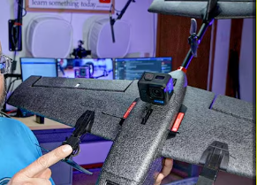
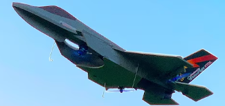
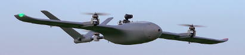

**Total time spent: 3 hours**

# May 12: Designing the airframe

Worked on the overall airframe design and finalized the approximate
dimensions for the fuselage, wings, and tail section (Took some inspiration from pre existing models)

Decided to use foam board for the primary structure because it is
lightweight, easy to cut, and suitable for rapid prototyping. Also
planned reinforcement points using carbon fiber rods for additional
strength. (AVOID using thermocol for this, as it is the WORST material you can, right now I am planning to use Craft Foam from a local art store called Itsy Bitsy)

Calculated rough estimates for:
- Wingspan
- Weight distribution
- Motor placement
- Battery positioning

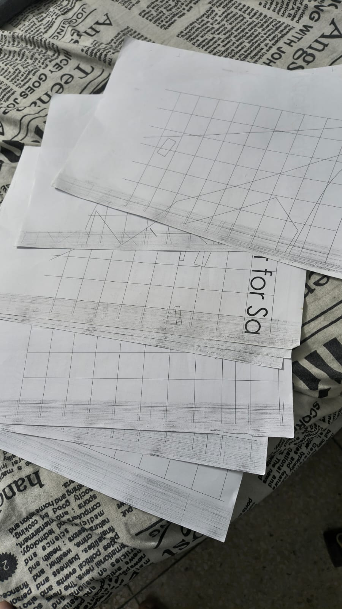
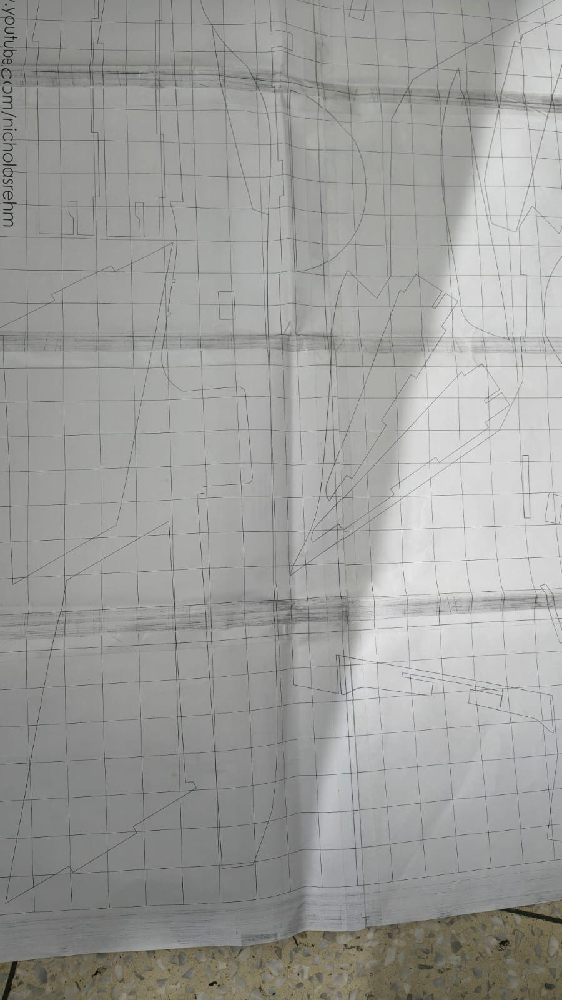

**Total time spent: 4 hours**

# May 14: Gathering components and electronics research

Started researching and selecting components required for the build.

Looked into:
- Brushless motors
- ESCs
- Flight controllers
- LiPo batteries
- Propellers
- RC transmitters and receivers

Compared thrust ratings and power requirements to ensure the aircraft
would generate enough lift for VTOL operations.

Prepared a preliminary parts list and checked compatibility between
components.

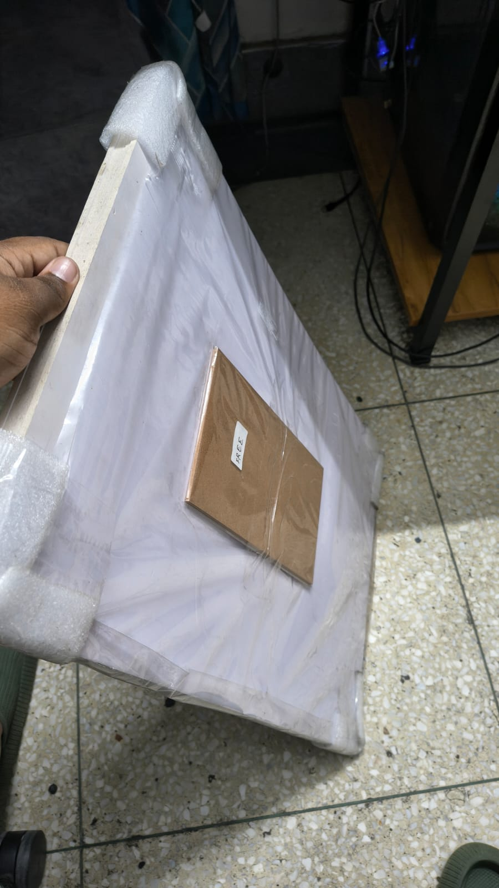

**Total time spent: 2.5 hours**

# May 15: Started cutting foam board pieces

Began cutting the foam board sections for the aircraft body and wings.
Used printed templates and measurements from the design sketches to mark
out the parts accurately.

Finished cutting:
- Main fuselage sections
- Wing outlines
- Vertical stabilizers

Also made rough control rods for the servos which will act as the flaps

Still need to cut and shape:
- Motor mounting sections
- Internal supports
- Landing structure components

Some cuts were uneven initially, so a few sections had to be redone for
better symmetry. (Anyways I am prototyping right now, so a little margin for error is acceptable for me)

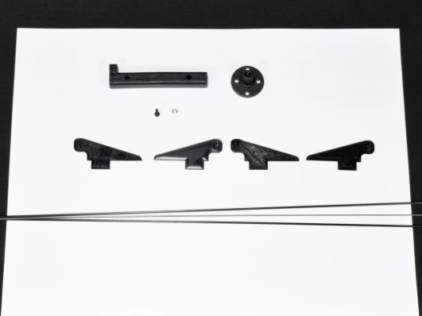

**Total time spent: 5 hours**

# May 16: Ordering components

Finalized the first batch of components and placed orders for the main
electronics required for the build.

Ordered:
- FS i6X (10 Channel Transmitter and Receiver)
- Brushless motors
- Propellers

Still deciding on the final flight controller, EC's, LiPo Battery and FPV system (probably a later update, but need to consider it right now so there is no compatibil;ity issues) since I
want the aircraft to support future upgrades and autonomous features (aiming for the sky, you WILL land upon the stars ;D)

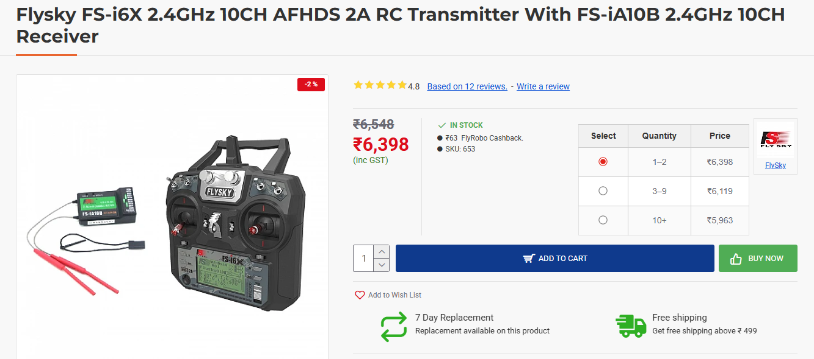

**Total time spent: 2 hours**

# May 17: Continuing structural work

Continued refining the foam board structure and aligning the fuselage
sections before assembly.

Test-fitted several parts together to check dimensions and balance.
Noticed slight alignment issues near the wing roots and adjusted the
cuts accordingly.

Currently waiting for components to arrive before beginning electronics
integration and motor mounting.

Also started writing the C++ code for ESP32 to debug lateron.

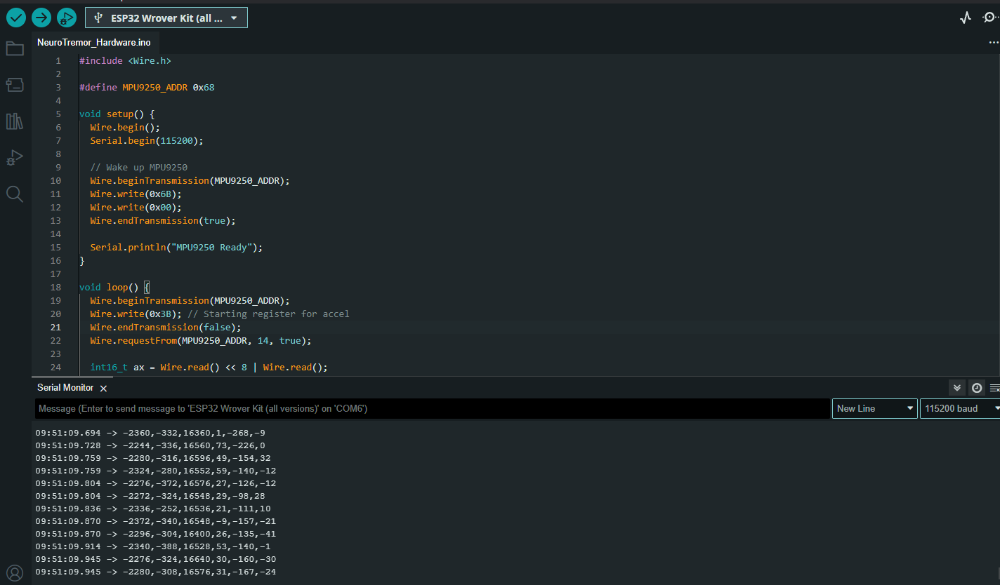

**Total time spent: 4.5 hours**

# May 21: Still waiting for the parts I ordered...... (Delays are unbearable :C )

Started experimenting with MPU 9250, Oled and ESP32 for data output for easier debugging. 
Later on ESP32 will be replaced by STM32 or Teensy 4.0. Since ESP32 can't handle and process
the VTOL calculations fast enough. 

Still deciding on my flight controller, as there seems to be a shortage of them in India.
Resellers are selling them for 4x the MRP D: .

Parts are expected to come by day after tmwr.
Today I mostly spent writing the code for ESP32 and Python implemeentation of that code to
create the visualization which is kinda cool and suprisingly informational, as now i know 
my MPU has a dead zone. Also capturing the data recorded by MPU in a csv file.

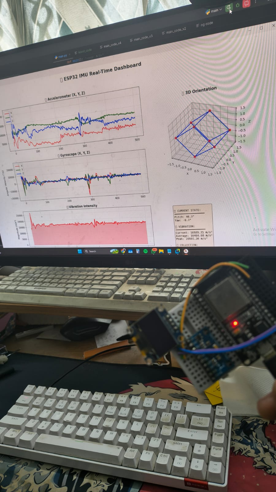
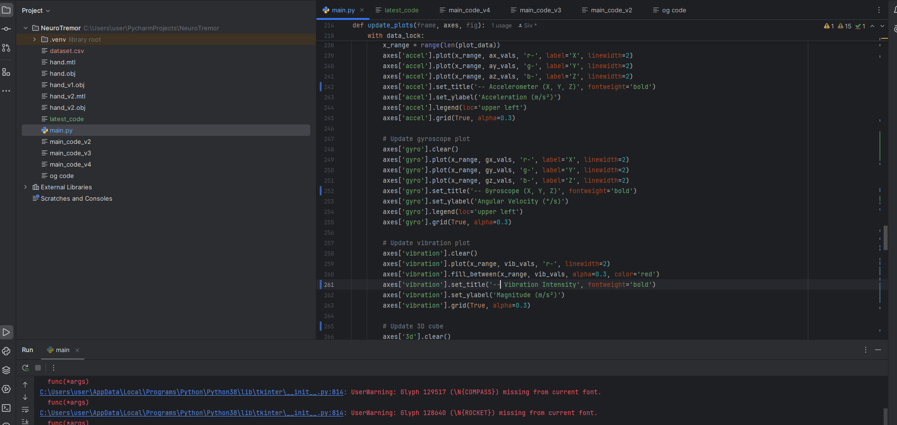

**Total time spent: 4 hours**
